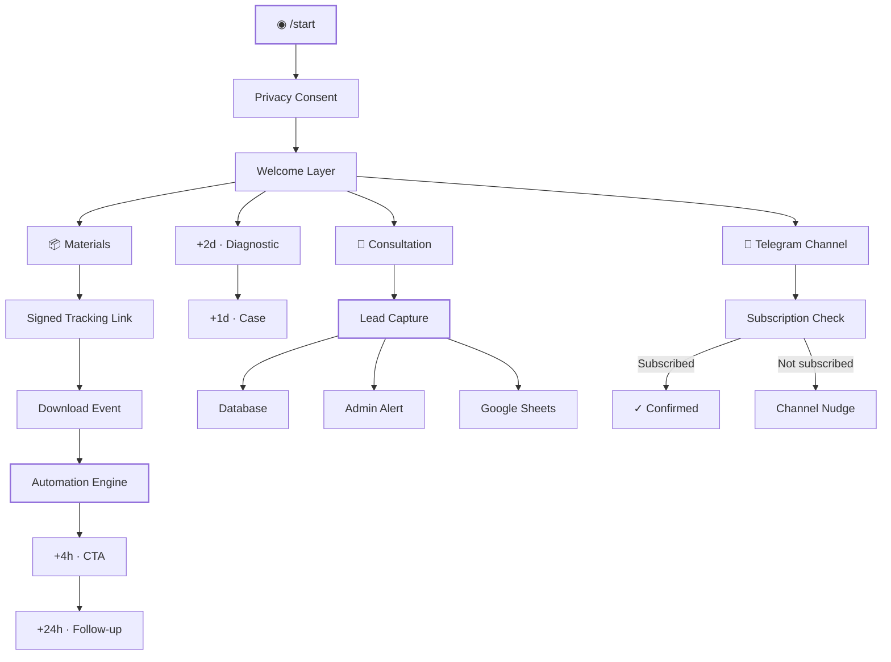

<div align="center">

# ◈ ВСЕЛЕННАЯ КАДРОВ

### LEADS · CHANNEL · AUTOMATION

**Telegram Funnel Engine · V4**

<br>

> Интеллектуальная Telegram-воронка для автоматического захвата лидов,
> выдачи материалов, прогрева аудитории и развития Telegram-канала.

<br>

`LEAD CAPTURE`　·　`AUTOMATION`　·　`ANALYTICS`　·　`CHANNEL GROWTH`

<br>


<br>

**From first touch → to qualified lead.**

</div>

---

## 01 / SYSTEM

Это не просто Telegram-бот.

**LEADS + CHANNEL V4** — событийная система автоматизации Telegram-воронки, которая сопровождает пользователя от первого `/start` до целевого действия.

Система умеет:

* фиксировать вход пользователя в воронку;
* получать согласие с политикой;
* выдавать полезные материалы;
* отслеживать переход к материалам;
* автоматически запускать цепочки follow-up сообщений;
* собирать заявки на консультацию;
* мгновенно уведомлять администраторов о новых лидах;
* проверять подписку на Telegram-канал;
* возвращать неподписавшихся пользователей;
* синхронизировать данные с Google Sheets;
* сохранять события для последующей аналитики.

В результате Telegram превращается из набора сообщений в **управляемую событийную систему**.

---

## 02 / FUNNEL ARCHITECTURE



---

## 03 / CORE ENGINE

### ◈ Lead Capture

Заявка пользователя превращается в структурированный lead-event и сохраняется внутри системы.

Администратор получает уведомление сразу после появления нового лида — без необходимости постоянно проверять Telegram или таблицы.

---

### ◈ Automation Engine

После ключевых действий пользователя запускаются отложенные сценарии.

```text
MATERIALS OPENED
       │
       ├──── +4 hours ────► CTA
       │
       └──── +24 hours ───► Follow-up


FIRST ENTRY
       │
       ├──── +2 days ─────► Diagnostic Question
       │
       └──── +3 days ─────► Case / Value Layer
```

Automation layer отделён от Telegram handlers и работает как самостоятельная часть бизнес-логики.

---

### ◈ Channel Growth

V4 добавляет отдельный слой развития Telegram-канала.

```text
USER
  │
  ▼
CHANNEL CTA
  │
  ▼
SUBSCRIPTION CHECK
  │
  ├── ✓ MEMBER ─────► continue
  │
  └── ✕ NOT MEMBER ─► delayed nudge
```

Проверка подписки выполняется через Telegram API.

---

### ◈ Event Analytics

Вместо хранения только конечного состояния система регистрирует действия пользователя как события.

Это позволяет анализировать путь:

```text
start
  ↓
consent
  ↓
welcome
  ↓
materials_click
  ↓
follow_up
  ↓
consultation
  ↓
lead
```

Такой подход позволяет в дальнейшем строить conversion analytics практически для любого этапа воронки.

---

## 04 / TECHNOLOGY

| Layer         | Technology                  |
| ------------- | --------------------------- |
| Runtime       | Python                      |
| Telegram      | aiogram                     |
| Configuration | pydantic-settings           |
| Database      | SQLite                      |
| Persistence   | Repository Layer            |
| HTTP          | Web endpoints               |
| Tracking      | HMAC signed redirects       |
| External Data | Google Sheets / Apps Script |
| Deployment    | Docker                      |
| Automation    | Async background workflows  |
| Testing       | Static + smoke + self-tests |

---

## 05 / PROJECT STRUCTURE

```text
.
├── app/
│   ├── bot/
│   │   ├── handlers/
│   │   ├── keyboards/
│   │   └── texts/
│   │
│   ├── db/
│   │   ├── models
│   │   ├── repositories
│   │   └── sessions
│   │
│   ├── services/
│   │   ├── automation
│   │   ├── analytics
│   │   ├── funnel
│   │   ├── channel
│   │   ├── notifications
│   │   └── google_sheets
│   │
│   └── web/
│       └── tracking endpoints
│
├── scripts/
│   ├── static audit
│   ├── smoke tests
│   └── self tests
│
├── .env.example
├── .gitignore
├── Dockerfile
└── README.md
```

Архитектура разделяет:

**Transport → Business Logic → Persistence → Integrations**

Это позволяет изменять отдельные части системы без превращения Telegram handlers в монолит.

---

## 06 / MATERIAL TRACKING

Открытие материалов проходит через подписанный redirect endpoint.

```text
Telegram
    │
    ▼
/materials/{telegram_id}/{signature}
    │
    ├── verify signature
    ├── register event
    └── redirect
            │
            ▼
       MATERIALS
```

Подпись формируется через:

```text
HMAC-SHA256
```

а проверка выполняется безопасным сравнением подписи.

Это позволяет отличать реальное открытие материала от обычной отправки пользователю сообщения.

---

## 07 / CONFIGURATION

Создайте локальный `.env` на основе шаблона:

```bash
cp .env.example .env
```

Основные параметры:

```env
TELEGRAM_BOT_TOKEN=
ADMIN_IDS=

GOOGLE_APPS_SCRIPT_URL=
GOOGLE_APPS_SCRIPT_SECRET=

GOOGLE_APPS_SCRIPT_TIMEOUT=
```

> [!IMPORTANT]
> `.env` содержит runtime-конфигурацию и потенциальные секреты.
> Он не должен попадать в Git.

В репозитории хранится только:

```text
.env.example
```

---

## 08 / QUICK START

### Clone

```bash
git clone <repository-url>
cd telegram-funnel-leads-channel-v4
```

### Environment

```bash
python -m venv .venv
```

Linux / macOS:

```bash
source .venv/bin/activate
```

Windows:

```powershell
.venv\Scripts\activate
```

### Dependencies

```bash
pip install -r requirements.txt
```

### Configuration

```bash
cp .env.example .env
```

Заполните необходимые параметры в `.env`.

### Run

Запустите приложение командой, предусмотренной текущей конфигурацией проекта.

---

## 09 / DOCKER

Проект подготовлен к контейнеризированному deployment.

```bash
docker build -t telegram-funnel-v4 .
```

```bash
docker run --env-file .env telegram-funnel-v4
```

Контейнер позволяет отделить приложение от локального Python environment и получить воспроизводимый runtime.

---

## 10 / SECURITY MODEL

Проект использует несколько уровней защиты.

**Secrets isolation**

Runtime-секреты хранятся вне Git в `.env`.

**Signed material links**

Tracking URL защищается HMAC-подписью.

**Constant-time comparison**

Проверка подписи выполняется через безопасный механизм сравнения.

**Private administrator scope**

Административные действия ограничиваются настроенными Telegram ID.

**External integration secret**

Google Apps Script integration использует отдельный shared secret.

### Production recommendation

Для production deployment рекомендуется использовать отдельный секрет:

```env
MATERIAL_LINK_SECRET=
```

вместо использования Telegram Bot Token в качестве ключа подписи tracking URL.

Также для особо чувствительных материалов можно добавить срок действия ссылки:

```text
telegram_id + timestamp + signature
```

---

## 11 / V4

```text
╭──────────────────────────────────────────────╮
│                                              │
│            LEADS + CHANNEL · V4              │
│                                              │
│    Telegram funnel → automation platform     │
│                                              │
╰──────────────────────────────────────────────╯
```

V4 расширяет исходную lead funnel архитектуру отдельным **Channel Growth Layer**.

### V4 includes

`✓` immediate admin lead alerts
`✓` private administrator list
`✓` subscription verification
`✓` channel CTA in onboarding
`✓` channel CTA in welcome flow
`✓` delayed channel nudge
`✓` live subscription callback
`✓` editable channel URL
`✓` editable nudge copy
`✓` upgrade compatibility
`✓` release marker

Статическая проверка релиза:

```text
LEADS + CHANNEL V4 STATIC AUDIT: OK
```

---

## 12 / DESIGN PRINCIPLES

Проект строится вокруг пяти принципов:

```text
01    EVENT DRIVEN
      Реагировать на действия пользователя.

02    AUTOMATION FIRST
      Минимизировать ручную работу.

03    OBSERVABILITY
      Фиксировать путь пользователя.

04    SEPARATION OF CONCERNS
      Telegram ≠ Business Logic ≠ Database.

05    EXTENSIBILITY
      Возможность добавлять новые сценарии
      без переписывания ядра.
```

---

## 13 / ROADMAP

Архитектура позволяет развивать систему дальше:

* PostgreSQL;
* Redis;
* task queue;
* webhook deployment;
* полноценный analytics dashboard;
* conversion cohorts;
* UTM attribution;
* A/B testing;
* CRM integration;
* lead scoring;
* retry / dead-letter queue;
* expiring material links;
* multi-funnel architecture.

---

## 14 / RELEASE

```text
PRODUCT     Вселенная кадров
ENGINE      LEADS + CHANNEL
VERSION     V4
STATUS      RELEASE
RUNTIME     Python
INTERFACE   Telegram
```

---

## 15 / AUTHORSHIP & RIGHTS

**Автор разработки: Парипа Максим Павлович**

Исходный код и архитектура проекта являются авторской разработкой.

Публичное распространение, перепродажа, публикация исходного кода, удаление информации об авторстве либо выдача разработки за собственную допускаются только с разрешения автора и в соответствии с условиями использования проекта.

---

<div align="center">

<br>

### ◈ LEADS + CHANNEL V4

**Build funnels that behave like systems.**

`CAPTURE`　→　`TRACK`　→　`AUTOMATE`　→　`CONVERT`

<br>

**Вселенная кадров · 2026**

</div>
